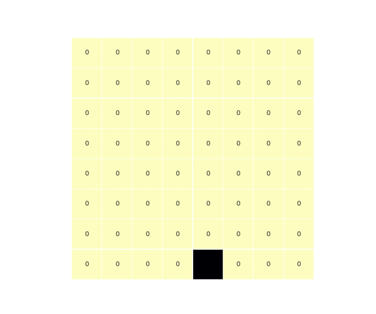

## PythonImportExample

This is the example package used in my blogpost [Visuallizing the Defective Chessboard Problem](https://polaris000.medium.com/visualizing-the-defective-chessboard-problem-aa5fc38b6e5e).

The post discusses the defective chessboard problem, also called the Tiling problem
The code here is provides a way to visualize the solution, and is an more organized version of the snippets in the blog post.



### Contents
The file structure is:
```
DefectiveChessBoard/
    defective_chessboard.py  # the script
    tiling.gif               # a gif demonstrating the tiling
```

### Usage
1. Clone this repo
2. Navigate to the DefectiveChessBoard directory
3. Execute the script

Simply execute:
```
$ git clone https://github.com/Polaris000/BlogCode.git 
$ cd DefectiveChessBoard
$ python defective_chessboard.py

```

The script provides two arguments:
- `k`: the size of the board is a function of `k`
    specifically, `size = 2^k`. The default value is `3`.

- `show_intermediate`: when set to True, each step of the tiling process generates
    a plot of the board, so you get an idea of how the tiling process exactly occurs. The default value is `False`.


---
You can find me on medium [here](https://polaris000.medium.com).